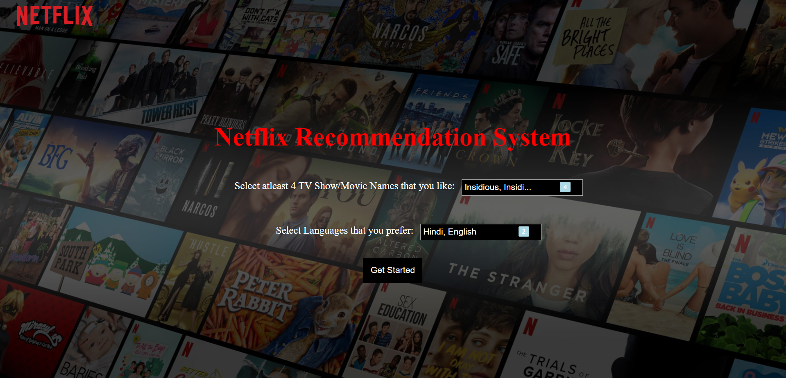
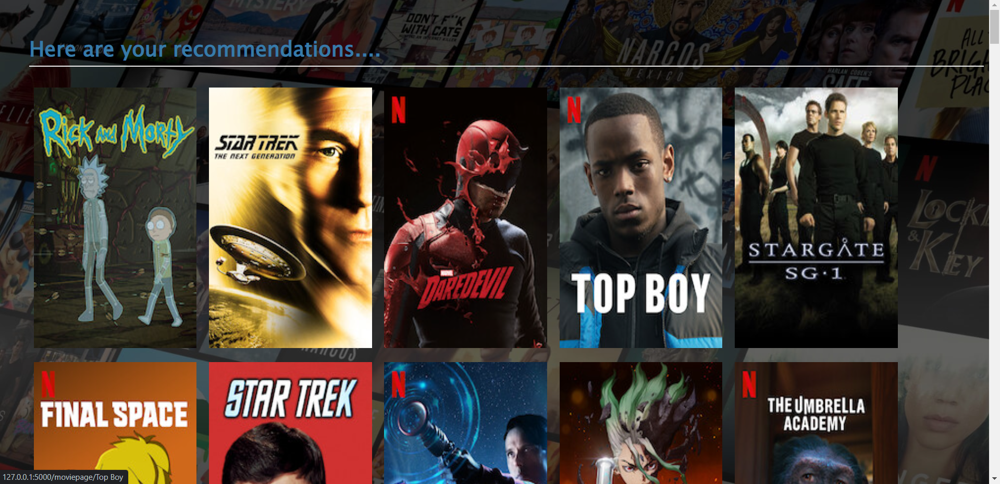
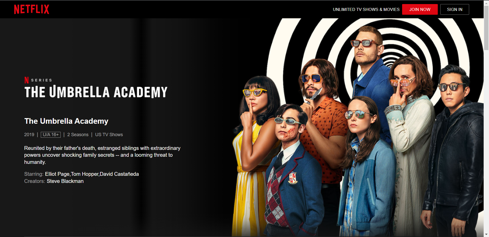

# OTT AI System 🎬



## 📋 About The Project

**OTT-AI-SYSTEM** is a machine learning-based movie recommendation web application. It analyzes content from a Netflix dataset to suggest movies to users based on their interests. The system utilizes a content-based filtering algorithm to provide personalized recommendations and offers a user-friendly interface to explore movie details.

### 🌟 Key Features
* **Smart Recommendations**: Get movie suggestions based on content similarity.
* **Search Functionality**: Easily search for your favorite movies.
* **Detailed Insights**: View comprehensive details about movies, including cast, genres, and descriptions.
* **Interactive UI**: A responsive and clean user interface built with HTML/CSS.

## 🛠️ Tech Stack

* **Backend**: Python (likely Flask)
* **Frontend**: HTML, CSS, JavaScript
* **Machine Learning**: Scikit-Learn, Pandas, NumPy
* **Data Processing**: Jupyter Notebook (`netflix.ipynb`)
* **Dataset**: `NetflixDataset.csv`

## 📂 Project Structure

```text
├── app.py                  # Main application file (Backend)
├── netflix.ipynb          # Data analysis and model training notebook
├── NetflixDataset.csv     # Dataset source
├── index.html             # Home page template
├── result.html            # Recommendation results template
├── moviepage.html         # Movie detail view template
├── style.css              # Main stylesheet
└── assets/                # Images and screenshots


Based on the repository analysis, here is a professional README.md file for your project. You can copy this code directly into your repository.

I have inferred the functionality from the file structure (Flask-style web app + Jupyter Notebook for ML) and the screenshots provided in your repo.

Markdown

# OTT AI System 🎬


## 📋 About The Project

**OTT-AI-SYSTEM** is a machine learning-based movie recommendation web application. It analyzes content from a Netflix dataset to suggest movies to users based on their interests. The system utilizes a content-based filtering algorithm to provide personalized recommendations and offers a user-friendly interface to explore movie details.

### 🌟 Key Features
* **Smart Recommendations**: Get movie suggestions based on content similarity.
* **Search Functionality**: Easily search for your favorite movies.
* **Detailed Insights**: View comprehensive details about movies, including cast, genres, and descriptions.
* **Interactive UI**: A responsive and clean user interface built with HTML/CSS.

## 🛠️ Tech Stack

* **Backend**: Python (likely Flask)
* **Frontend**: HTML, CSS, JavaScript
* **Machine Learning**: Scikit-Learn, Pandas, NumPy
* **Data Processing**: Jupyter Notebook (`netflix.ipynb`)
* **Dataset**: `NetflixDataset.csv`

## 📂 Project Structure

```text
├── app.py                  # Main application file (Backend)
├── netflix.ipynb          # Data analysis and model training notebook
├── NetflixDataset.csv     # Dataset source
├── index.html             # Home page template
├── result.html            # Recommendation results template
├── moviepage.html         # Movie detail view template
├── style.css              # Main stylesheet
└── assets/                # Images and screenshots


📊 Model Workflow
The recommendation logic is developed in netflix.ipynb:

Data Loading: Loads the NetflixDataset.csv.

Preprocessing: Cleans data and processes text features (Cast, Director, Description).

Vectorization: Converts text data into vectors.

Similarity Calculation: Uses Cosine Similarity to find movies closest to the user's choice.


Home Page,Movie Details
"",""

Recommendations	Netflix Page
	
